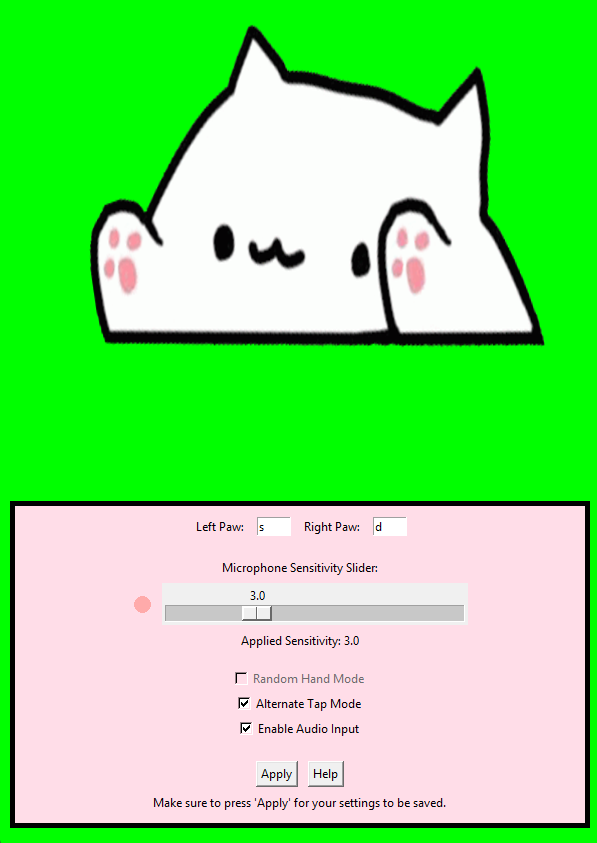

### Bongo Cat Overlay 1.1
Made some improvements with this one:

**Improved visual clarity:** improved spacing, rotated image, and a cool black border. very cool.

**Added new modes:** random and alternate
- One taps a random paw with each keypress and the other will always alternate. These both work with every key on your keyboard, not just the two selected (I thought it would be cool to type with) but I'll probably make that a toggleable feature in the future.

**Added an option to disable audio input:** maybe you don't want the cat to open its mouth. I basically just saved your life.

**Changes to the help page:** at least I think I made some. I don't really remember if I did anything.

In the future I'd like to make it a little more expressive. Maybe have a customization window that will let you put on some cool hats or something. some very cool hats. Or maybe more expressions with angry/shocked/happy faces. Maybe a sweat drop and a '!' when you're tapping really fast. I don't know.

