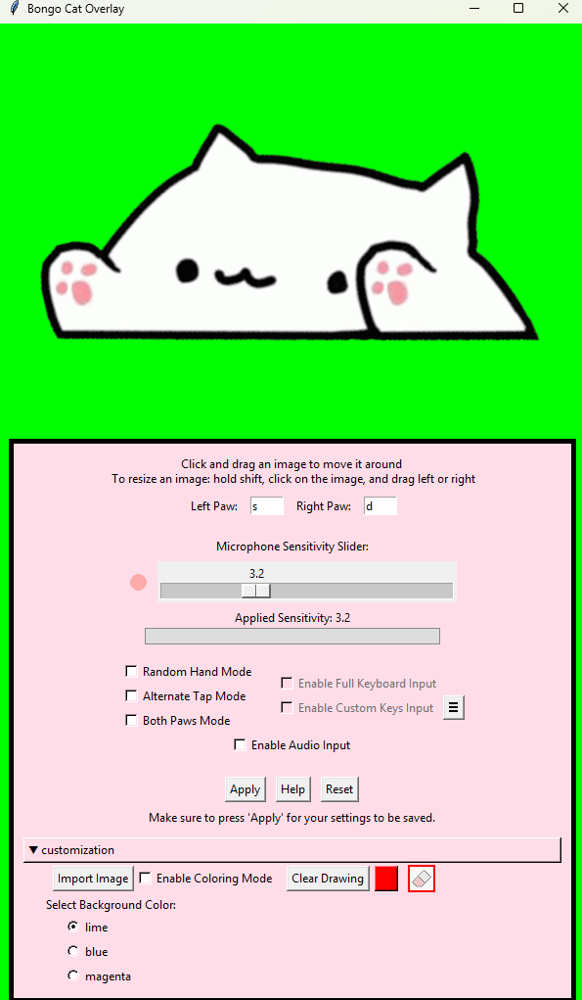
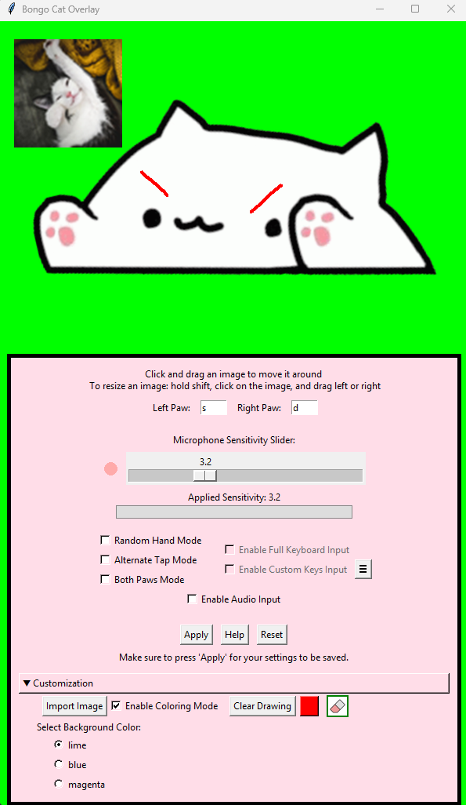

# Made a bunch of changes with this one

**Customization Menu:** 
- **Added the ability to import images**
  - Move them around by dragging with left click and resize by holding shift and dragging.
  - Delete images by pressing the red X at the top right when your mouse is hovering over them.
  - Supports transparency. Give him a cool hat for me.
- **Added the ability to color on the overlay**
  - Therapy cost money. Color mode is free. Comes with a functioning color picker and eraser. Make art... or at least something colorful.
- **You may now change the background color for chroma keying**
  - I really have no clue why'd you need to do this, but I added it anyway.
- **Took me a long time, and by that I mean like five hours. Gonna take a nap in a minute here.**

  
  

**Other Changes:**
- **Adjusted padding and alignment between some elements**
- **Now allows manual resizing:** No more yucky 600x800 dimensions you were forced to use before. Why'd I even do that.
- **Updated the help menu with some newer stuff**
  - If you ever run into something that you can't fix yourself, give up or message me on discord. My username is kmkt and I'll try to get back to you.
- **Added a reset button:** undo all of your mistakes. Only in the program though.
- **You may now use custom key inputs:** if you want only specific keys to result in the cat using its paws, you can now do that.
- **Added support for new keys:** now you can get the cat to pat with things like your mouse clicks. The guide to making this work is in the custom key input menu.
- **Improved the image of the cat:** beforehand some of the images weren't aligned properly. I fixed that.

**Future changes?**
- Not for a while, unless I really need to procrastinate something. It'd be cool to have a second mode where one of the cats paws is holding a mouse that reacts to your movements and the other is patting the keyboard. I know people have already done this, but the whole point is that I do it. Me.
- Currently the custom keys only work with the unique tap modes. In the future I might allow you to choose which keys pat which paw.
- Any ideas would be nice. Shoot me a message.
